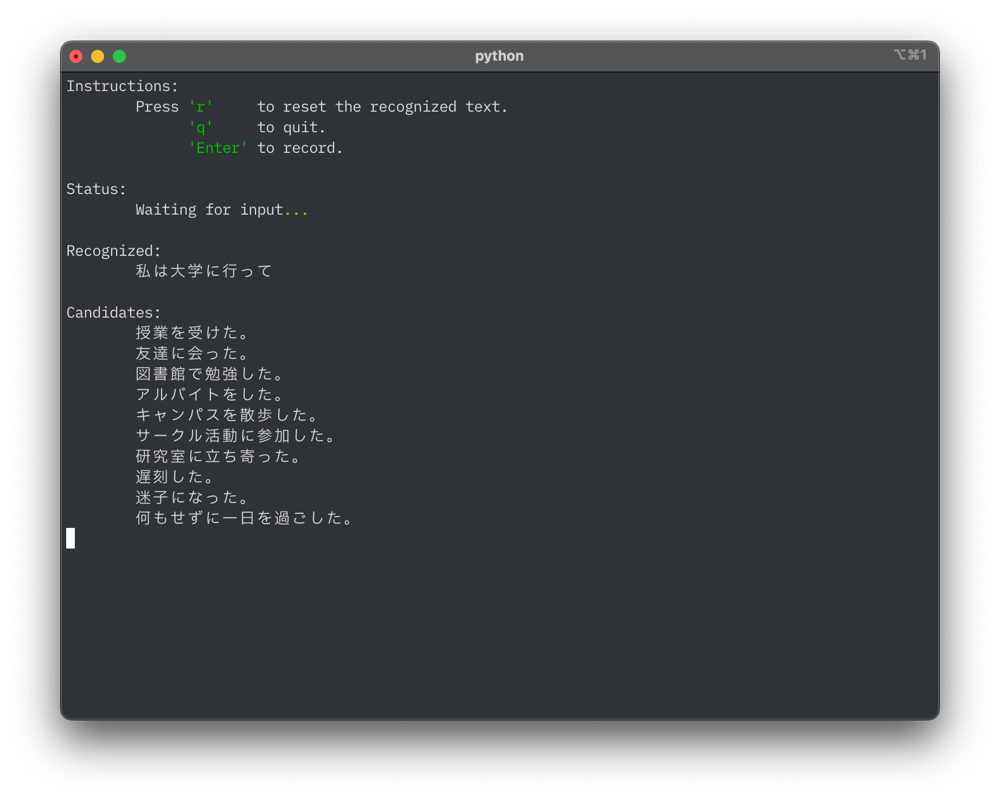

# Speech Assistant

音声版の文章補完を行うプログラムです.

## 使用技術

| Python              | ランタイム |
| ------------------- | ---------- |
| SpeechRecognition   | 音声認識用 |
| google-generativeai | 文章補完用 |
| rich                | ログ出力用 |

## 画面

### 初期画面

### 「私は大学に行って」と音声入力した画面

